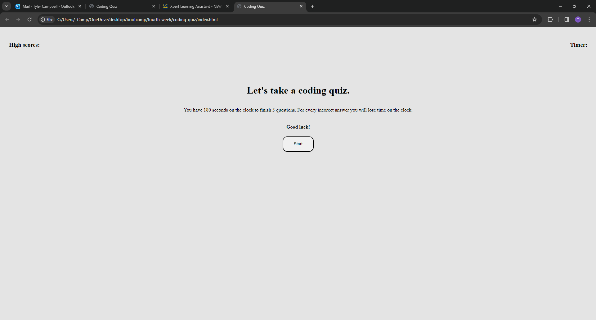

# Coding Quiz

## Description
This is a coding quiz that I created from scratch. There are 5 questions in this quiz. You have 180 seconds to complete the quiz
For every question you get wrong there is 15 seconds deducted on the clock. Once the quiz is complete the time left on the timer
is your score. I really learned a lot more about JavaScript in this project such as timer intervals. This project was a real
eye opener for me in terms of learning how powerful JavaScript can be.

## Usage
In the top left you can click on the link to the High Scores to see your past high scores which are stored in the local storage.
Click start to start the quiz. Once you click on an answer it will automatically go to the next question. The bottom of the answer
column it will tell you if you were correct or incorrect. Once you complete the quiz there will be a form where you can
enter your name to save your score in the local storage. If you run out of time you will be prompted to start over.

## Credits

https://www.w3schools.com/css/
https://developer.mozilla.org/en-US/
I also used the Xpert learning assistant in bootcampspot.

## How to view my project

Click this link https://tcampbell-93.github.io/coding-quiz/

